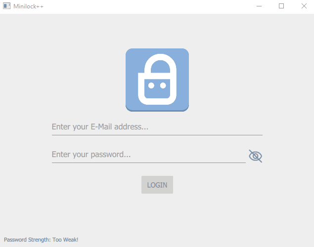

# minilockcpp


This project is a crossplatform multi threaded C++ port of the minilock javascript library with a Qt5 GUI.

## Preview


## How to build
```console
# Clone repository
git clone https://github.com/mrom1/minilockcpp.git
cd minilockcpp

# Configure
cmake -S. -Bbuild -DQt5_DIR=<PATH_TO_YOUR_QT_DIR_CONTAINING_CMAKE_FILES>

# Build
cmake --build build
```

## Run tests
```console
cd build
ctest 
```

## How to use the library
Simple example showing how to encrypt / decrypt a file:  
```cpp
#include <minilock.h>

auto session = new minilockcpp::minilock("your@email.com", "your_password");

// Using default parameters, check out the API for all arguments
session->encrypt_file("myfile.dat");

// Using default parameters, check out the API for all arguments
session->decrypt_file("myfile.dat");

// Cleanup
delete session;
```


## ToDo

- [x] Add Documentation
- [x] Update external dependencies lookup for Windows users
- [ ] Add Qt GUI tests
- [x] Add Github Actions
- [ ] Add CLI to use the library without a GUI

